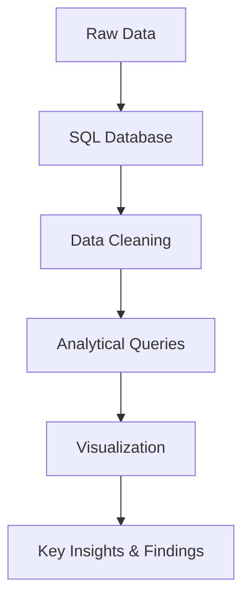

# Online Coffee Company Expansion Project: A Data-Driven Approach to Strategic Growth


# Project Overview

## Monday Coffee Expansion 🚀   

### 📌 Project Objective and Business Problem
Monday Coffee, an online coffee retailer since January 2023, is looking to expand its business by opening physical stores in India. This project analyzes historical sales data to identify the **top three cities** with the highest potential for expansion, based on consumer demand, revenue, and key market trends.
-  

### 🎯 Key Goals
- **Data Cleaning & Preparation:** Process raw data to ensure accuracy and consistency.  
- **Sales & Consumer Analysis:** Identify revenue trends, customer preferences, and market demand across different cities.  
- **Market Potential Assessment:** Evaluate cities based on population, estimated coffee consumers, and average revenue per customer.  
- **Business Recommendations:** Provide data-driven insights to guide store expansion decisions.

### ☕📊 Expected Outcomes 
By analyzing sales patterns and customer behaviors, this project aims to identify the most promising locations for expansion, helping Monday Coffee **maximize revenue, optimize store placement, and enhance customer experience.**  

---

### 🛠️ Technology Stack 
- **Data Handling & Cleaning:** Microsoft Excel  
- **Database Management:** PostgreSQL  
- **Query Language:** SQL (DDL, DML, Aggregations, Joins, Subqueries, Window Functions)
- **Visualization:** Powerbi
-    


### **Data Source**  
The dataset was sourced from **[Maven Analytics](https://www.maven.com/)** and contains information on:  
- **Sales Transactions** – Records of all coffee sales.  
- **Cities** – Information on potential and existing sales locations.  
- **Customers** – Demographic and behavioral data of consumers.  
- **Products** – Details on coffee types and pricing.

---

## Data Processing Pipeline


---  

## Project Structure

### 1. Data Preparation & Data Cleaning: 
- Data understanding, exploration, data loading.
- Check dataset structure using Column Headers & Data Types
- Standardizing Data Formats
---
### 2. Schemas Setup
- **Database Creation:** The project begins with setting up a database named `monday_coffee_db`.  
- **Table Creation:** Create all neccesary table to store required data.

```sql
  -- Monday Coffee SCHEMAS

DROP TABLE IF EXISTS sales;
DROP TABLE IF EXISTS customers;
DROP TABLE IF EXISTS products;
DROP TABLE IF EXISTS city;

-- Import Rules
-- 1st import to city
-- 2nd import to products
-- 3rd import to customers
-- 4th import to sales

CREATE TABLE city
(
	city_id	INT PRIMARY KEY,
	city_name VARCHAR(15),	
	population	BIGINT,
	estimated_rent	FLOAT,
	city_rank INT
);

CREATE TABLE customers
(
	customer_id INT PRIMARY KEY,	
	customer_name VARCHAR(25),	
	city_id INT,
	CONSTRAINT fk_city FOREIGN KEY (city_id) REFERENCES city(city_id)
);

CREATE TABLE products
(
	product_id	INT PRIMARY KEY,
	product_name VARCHAR(35),	
	Price float
);

CREATE TABLE sales
(
	sale_id	INT PRIMARY KEY,
	sale_date	date,
	product_id	INT,
	customer_id	INT,
	total FLOAT,
	rating INT,
	CONSTRAINT fk_products FOREIGN KEY (product_id) REFERENCES products(product_id),
	CONSTRAINT fk_customers FOREIGN KEY (customer_id) REFERENCES customers(customer_id) 
);

-- END of SCHEMAS
```
---
### 3. Insert data Into schemas
- Import data and values into each created schema to populate table and allow querying the data
- Import cleaned data from excel into schemas
  
### 4. Key Business Insights (MONDAY COFFEE DATA ANALYSIS & BUSINESS PROBLEMS SOLVING)
- 1. **Coffee Consumers Count:**
  How many people in each city are estimated to consume coffee, given that 25% of the population does?
```sql
SELECT city_name,
	ROUND((population * 0.25)/1000000, 2) estimated_population_in_millions,
	city_rank
FROM city
ORDER BY 2 DESC
```
##### Sql Output:

##### Powerbi:


- 2. **Total Revenue from Coffee Sales:**
What is the total revenue generated from coffee sales across all cities in the last quarter of 2023?
```sql
SELECT
    c.city_name,
    SUM(s.total) AS total_sales
FROM 
    sales s
JOIN customers cus
    ON s.customer_id = cus.customer_id
JOIN city c
    ON cus.city_id = c.city_id
WHERE 
    EXTRACT (YEAR FROM sale_date) = 2023 AND
	EXTRACT (quarter FROM sale_date) = 4
GROUP BY c.city_name
ORDER BY total_sales DESC;
 ```
- 3. **Order Count for Each Product:**
How many total order of each coffee product have been made?
```sql
SELECT p.product_name,
	COUNT (s.*) total_orders
FROM sales s
JOIN products p 
ON s.product_id = p.product_id
GROUP BY 1
ORDER BY total_orders DESC
```

- 4. **Average Sales Amount per City:**
What is the average sales amount per customer in each city?
```sql
SELECT c.city_name,
	COUNT (DISTINCT cus.customer_id) total_customers,
	SUM (p.price) revenue,
	ROUND(SUM (p.price)::numeric/COUNT (DISTINCT cus.customer_id)::numeric,0) avg_price
FROM city c
JOIN customers cus
ON c.city_id = cus.city_id
	JOIN sales s 
	ON cus.customer_id = s.customer_id
	JOIN products p
	ON s.product_id = p.product_id
GROUP BY 1
ORDER BY avg_price DESC
```
##### Sql Output:


- 5. **City Population and Coffee Consumers:**
Provide a list of cities along with their populations and estimated coffee consumers (assume 25% of total population).
```sql
SELECT c.city_name city_name,
	ROUND((population * 0.25)/1000000, 2) estimated_coffee_consumers_millions,
	COUNT(DISTINCT cus.customer_id) unique_customers
FROM city c
JOIN customers cus
ON c.city_id = cus.city_id
GROUP BY city_name, estimated_coffee_consumers_millions
	ORDER BY unique_customers DESC;
```
- 6. **Top Selling Products by City:**
What are the top 3 selling products in each city based on order volume?
```sql
SELECT *
	FROM (
			SELECT c.city_name city,
			p.product_name product_name,
			COUNT (s.sale_id) total_order,
			DENSE_RANK () OVER (PARTITION BY c.city_name ORDER BY COUNT (s.sale_id) DESC) product_rank
		FROM sales s
		JOIN products p
		ON s.product_id = p.product_id
		JOIN customers cus
		ON s.customer_id = cus.customer_id
		JOIN city c
		ON cus.city_id = c.city_id
		GROUP BY city, product_name
		)
WHERE product_rank BETWEEN 1 AND 3
```
- 7. **Customer Segmentation by City:**
How many unique customers are there in each city who have purchased products with ID 1-14?
```sql
SELECT c.city_name city,
	COUNT (DISTINCT s.customer_id) customer_count
FROM sales s
JOIN customers cus
ON s.customer_id = cus.customer_id
JOIN city c
ON c.city_id = cus.city_id
JOIN products p
ON s.product_id = p.product_id
WHERE s.product_id IN (1,2,3,4,5,6,7,8,9,10,11,12,13,14)
GROUP BY city
ORDER BY customer_count DESC;
```
- 8. **Average Sale vs Rent:**
Find each city and their average sale per customer and avg rent per customer
```sql
SELECT 
    c.city_name,
    COUNT(DISTINCT cus.customer_id) AS total_customers,
    ROUND(SUM(p.price)::numeric / COUNT(DISTINCT cus.customer_id)::numeric, 0) AS avg_price,
    ROUND(c.estimated_rent::numeric / COUNT(DISTINCT cus.customer_id)::numeric, 2) AS avg_rent_per_customer
FROM city c
JOIN customers cus
    ON c.city_id = cus.city_id
JOIN sales s 
    ON cus.customer_id = s.customer_id
JOIN products p
    ON s.product_id = p.product_id
GROUP BY c.city_name, c.estimated_rent
ORDER BY avg_price DESC;
```
##### Sql Output:


- 9. **Monthly Sales Growth:**
Sales growth rate: Calculate the percentage growth (or decline) in sales over different time periods (monthly)
```sql
SELECT 
    *,
   ROUND(((cr_sale - last_month_sale)::numeric / last_month_sale)::numeric * 100,2) AS growth_rate
FROM (
    SELECT 
        city,
        month,
        year,
        total_sale AS cr_sale,
        LAG(total_sale, 1) OVER (PARTITION BY city ORDER BY year, month) AS last_month_sale
    FROM (
        SELECT 
            c.city_name AS city,
            EXTRACT(MONTH FROM s.sale_date) AS month,
            EXTRACT(YEAR FROM s.sale_date) AS year,
            SUM(s.total) AS total_sale
        FROM 
            sales s
        JOIN customers cus
            ON s.customer_id = cus.customer_id
        JOIN city c
            ON c.city_id = cus.city_id
        JOIN products p
            ON s.product_id = p.product_id
        GROUP BY c.city_name, EXTRACT(YEAR FROM s.sale_date), EXTRACT(MONTH FROM s.sale_date)
        ORDER BY c.city_name, year, month
    ) sub
) final;
```
- 10. **Market Potential Analysis:**
Identify top 3 city based on highest sales.
```sql
SELECT 
    c.city_name AS city,
    SUM(s.total) AS revenue,
    c.estimated_rent,
    COUNT(DISTINCT cus.customer_id) AS customer_count,
    ROUND((c.population * 0.25) / 1000000, 2) AS estimated_coffee_consumers_millions,
    ROUND(c.estimated_rent::numeric / COUNT(DISTINCT cus.customer_id)::numeric, 2) AS avg_rent_per_customer
FROM 
    sales s
JOIN customers cus
    ON s.customer_id = cus.customer_id
JOIN city c
    ON c.city_id = cus.city_id
JOIN products p
    ON s.product_id = p.product_id
GROUP BY 
    c.city_name, 
    c.estimated_rent, 
    c.population
ORDER BY revenue DESC;
```
##### Sql Output:


--- 

### Desktop Screenshots


---
## 5. Project Reports & Visualizations:
- **Sales Summary:** Overview of total sales, customer demographics, and category performance.  
- **City Insights Analysis:** Insights into city-level performance with key insights on top cities by customers, order trends, market score, and rent-to-revenue ratio to identify high-performing and growth-potential locations. 
- **Business Recommendations:** Strategic suggestions based on key analysis and findings aimed at improving business performance, efficiency, or profitability. 
### Dashboard Overview:

### City Insights Page:


### Recommendations Page:


## 🔗 Power BI Dashboard Link
Click To View [View the Interactive Retail Sales Dashboard to view Key Visuals](https://app.powerbi.com/reportEmbed?reportId=2dd5966c-a761-4b44-8a47-56081379b725&autoAuth=true&ctid=3af45fec-8c0e-49be-8467-608b1fd05a35)

---
## 6. Business Recommendations
Based on the in-depth analysis of Monday Coffee’s sales data, the following recommendations are proposed to support the company’s expansion strategy:
	
### Strategic Store Expansion

- The top three recommended cities for new store openings are **Pune**, **Delhi**, and **Jaipur** due to their high sales potential, significant coffee-consuming population, and favorable rent-to-revenue ratios.

- Pune has the highest total revenue, making it an ideal location for immediate expansion.

- Delhi boasts the highest number of estimated coffee consumers (7.7 million) and total customers, indicating a strong potential customer base.
- Jaipur offers a high number of unique customers with an exceptionally low average rent per customer, making it a cost-effective expansion opportunity.

### Customer-Centric Product Offerings
- Analyzing product trends indicates that certain coffee products perform better in specific cities. Monday Coffee should tailor its product offerings based on regional preferences to maximize sales.

- Introducing location-based promotions and limited-time offers can further drive engagement and sales.

### Marketing & Customer Engagement Strategies

- Investing in digital marketing campaigns focused on Delhi, Pune, and Jaipur can help boost brand awareness before store openings.

- Implementing loyalty programs and discounts for frequent buyers will encourage repeat purchases.

- Leveraging data-driven insights to create personalized offers based on customer purchase history and preferences.

### Optimizing Pricing & Rent Efficiency

- The analysis of average sales per customer versus rent per customer shows that Jaipur and Pune provide optimal cost efficiency.

- Ensuring that store locations in these cities maintain affordable rental costs while maximizing customer footfall will enhance profitability.

### Seasonal & Growth-Based Sales Strategies

- Monthly sales growth trends indicate periods of high and low sales. Planning promotional activities during peak seasons and implementing retention strategies during slower months can stabilize revenue streams.

- Tracking sales growth and consumer behavior over time will help refine marketing and sales strategies for future store expansions.

---

## Conclusion

This project effectively demonstrates how SQL can be leveraged to extract valuable business insights from sales data, enabling data-driven decision-making. The analysis identifies high-potential cities for expansion based on key metrics such as revenue, customer count, estimated coffee consumers, and rent efficiency. By strategically expanding into Pune, Delhi, and Jaipur, Monday Coffee can capitalize on market demand, optimize operational costs, and enhance customer experience. With a continued focus on data-driven strategies, the company can scale its retail presence efficiently while maintaining profitability and customer satisfaction. Future analyses should incorporate additional factors such as competitor presence, operational logistics, and consumer preferences to refine expansion decisions further. This data-backed approach ensures that Monday Coffee maximizes its growth potential while delivering an exceptional coffee experience to its expanding customer base.

---

## 📌 About Me
Hi, I'm Oluwatosin Amosu Bolaji, a Data Analyst with strong skills in Python, SQL, Power BI, and Excel. I turn raw data into actionable insights through automation, data storytelling, and visual analytics. My work is rooted in analytical thinking, strong business acumen, and technical expertise. Whether it's uncovering hidden trends, optimizing workflows, or translating data into compelling stories, I bring clarity and direction to data—helping organizations make smarter, faster decisions.

## 💡 Tools & Tech:
- **Python** (Pandas, NumPy, Matplotlib, Seaborn)
- **SQL** (MsSQL, Postgree, MySQL)
- **Microsoft Power BI**
- **Microsoft Excel**
- 🔹 **Key Skills:** Data wrangling, dashboarding, reporting, and process optimization.
-    


#### 🚀 **Always learning. Always building. Data-driven to the core.**  

### 📫 **Let’s connect!**  
- 📩 oluwabolaji60@gmail.com
- 🔗 : [LinkedIn](https://www.linkedin.com/in/oluwatosin-amosu-722b88141)
- 🌐 : [My Portfolio](https://www.datascienceportfol.io/oluwabolaji60) 
- 𝕏 : [Twitter/X](https://x.com/thee_oluwatosin?s=21&t=EqoeQVdQd038wlSUzAtQzw)
- 🔗 : [Medium](https://medium.com/@oluwabolaji60)
- 🔗 : [View my Repositories](https://github.com/Tbrown1998?tab=repositories)
